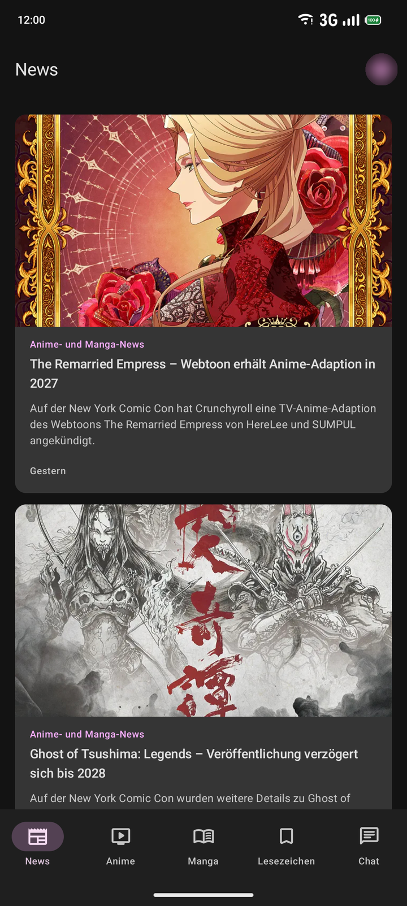
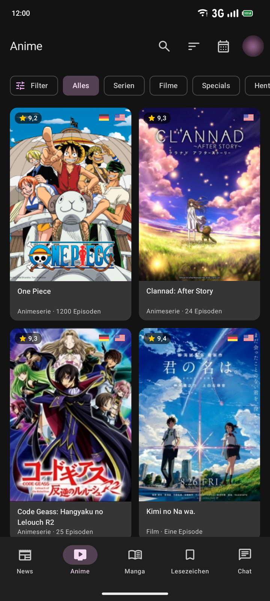
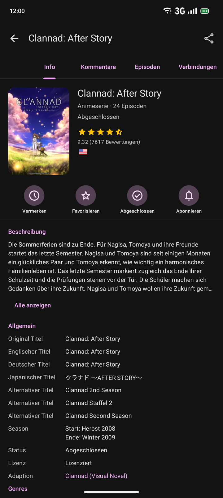
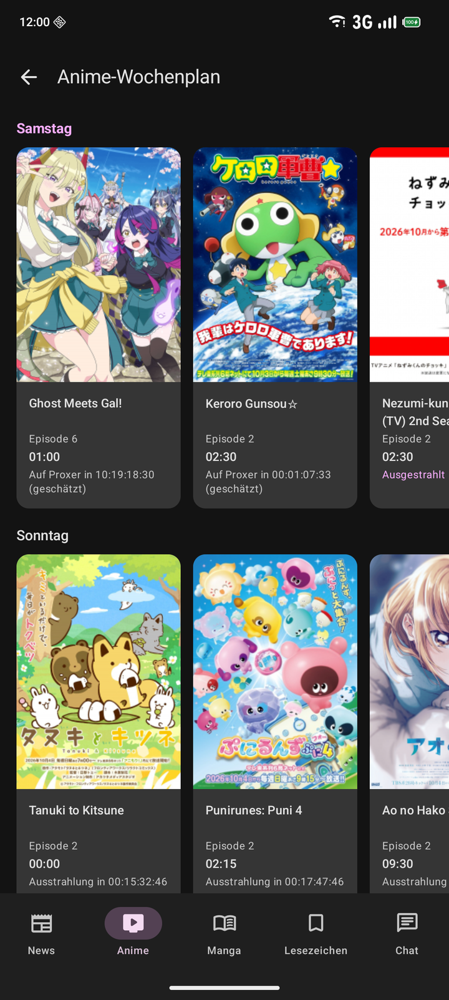
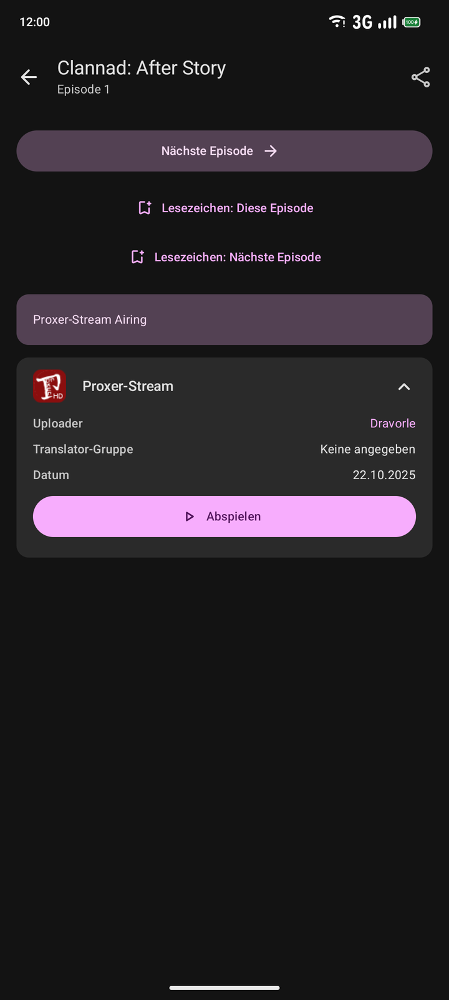
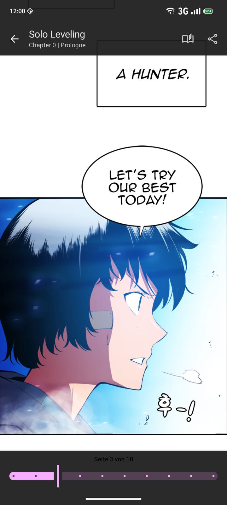
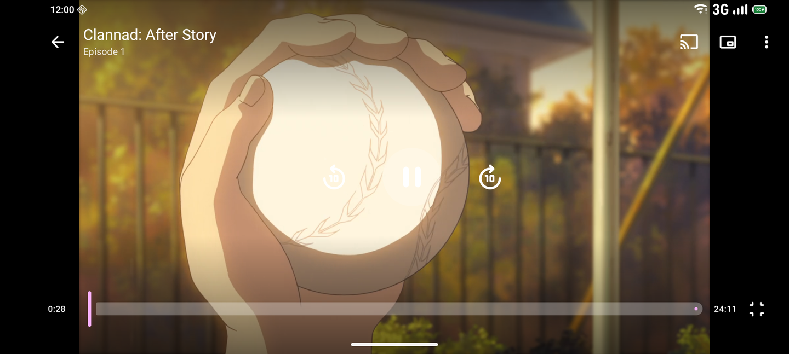
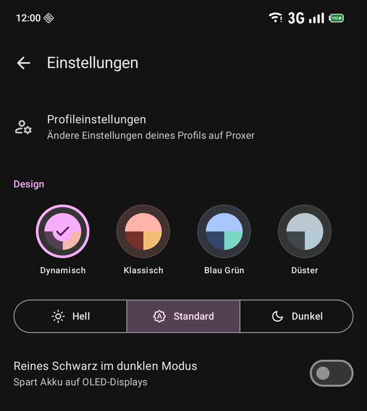

#  Proxer.Me Android [](https://github.com/proxer/ProxerAndroid/releases/latest) [](https://github.com/proxer/ProxerAndroid/actions?workflow=CI)

### Unmaintained

This app is not maintained anymore and will not receive any more updates. It might or might not work anymore.

### About this fork

This fork contains fixes on top of the last official release (1.11.5):

- The manga reader shows WebP pages, which are used by many newer webtoon uploads. Previously these pages stayed
  blank forever ([#1](https://github.com/MrP1ck/ProxerAndroid/pull/1)).
- The project builds again after the shutdown of jcenter.
- The UI is rewritten with Jetpack Compose and Material 3: Material You colors (with the previous color schemes as
  presets and a pure black option), a bottom navigation bar on phones and a navigation rail on tablets, edge-to-edge
  screens, Glance widgets and a themed launcher icon. The stream player uses Media3 and supports
  picture-in-picture.
- The toolchain is current: Gradle 8, the Android Gradle Plugin 8, Kotlin 2 and KSP. Android 6.0 or newer is
  required.

Download the app from the [releases of this fork](https://github.com/MrP1ck/ProxerAndroid/releases/latest) or build it
yourself. The official releases on Google Play and in the Proxer App Store are the old version 1.11.5.

### What is this?

Proxer.Me Android is a modern mobile client for the german Anime & Manga page [Proxer.Me](https://proxer.me).<br>
It features major functionalities including an anime player for various hosters and languages, a mobile-friendly manga reader, offline synchronized chat and much more.

#### Building yourself

After having installed the following tools: 

- [Git](https://git-scm.com/download)
- [JDK 17](https://adoptium.net/temurin/releases/?version=17)
- [Android SDK](https://developer.android.com/studio/#downloads)

You can run these commands:

- `git clone https://github.com/MrP1ck/ProxerAndroid`
- `cd ProxerAndroid`

This app needs an API-key to work. You can request one from the administrators at Proxer.
You then need to create a `secrets.properties` file in the root of the project with the following contents:

```
PROXER_API_KEY = YourApiKey
```

This app offers three variants to build: `debug`, `release` and `logRelease`.<br>
It is strongly recommended to use the `release` variant as it is faster and does not log sensitive data.

Before building, [generate a key](https://developer.android.com/studio/publish/app-signing.html#generate-key)
for signing the app if you have none yet.<br>
Add these fields to your `secrets.properties` file:

```
RELEASE_STORE_FILE = /path/to/the/keystore
RELEASE_STORE_PASSWORD = theKeystorePassword
RELEASE_KEY_ALIAS = theAlias
RELEASE_KEY_PASSWORD = thePasswordForThatAlias
```

You can then build the app by running:

```bash
# Linux
./gradlew assembleRelease

# Windows
gradlew.bat assembleRelease
```

You can find the app in the `build/outputs/apk/release/` folder.<br>
A direct install of the app is possible for phones connected to your pc by running:

```bash
# Linux
./gradlew installRelease

# Windows
gradlew.bat installRelease
```

If you want to build the app for testing purposes in the `debug` variant, run:

```bash
# Linux
./gradlew assembleDebug

# Windows
gradlew.bat assembleDebug
```

The dependencies are declared in the version catalog `gradle/libs.versions.toml` and come from Google's Maven
repository, Maven Central and JitPack (see `settings.gradle`).

### Screenshots

| News                         | Anime List                         | Media Detail                         |
|------------------------------|------------------------------------|--------------------------------------|
|  |  |  |

| Anime Schedule                   | Anime Stream List                     | Manga Reader                         |
|----------------------------------|---------------------------------------|--------------------------------------|
|  |  |  |

| Anime Player                       | Design Settings                           |
|------------------------------------|-------------------------------------------|
|  |  |

### Contributions and contributors

A guide for contribution can be found [here](.github/CONTRIBUTING.md).

- [@InfiniteSoul](https://github.com/InfiniteSoul) for implementing a persistent Navigation Drawer for tablets and UI improvements.
- [@MrP1ck](https://github.com/MrP1ck) for the UI redesign.
